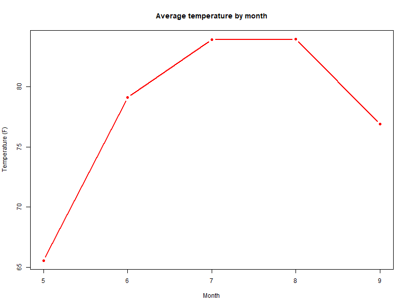
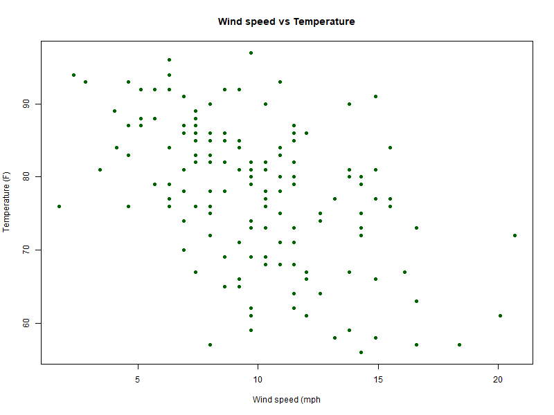
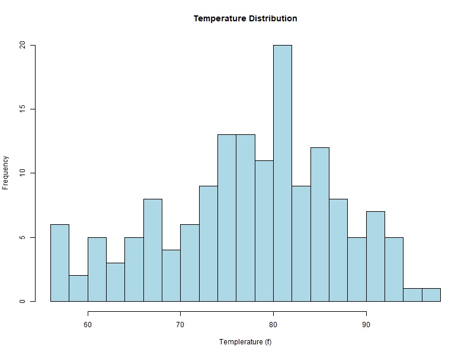

# Weather Data Analysis Project

## Overview
This project analyzes air quality and weather patterns using R programming, focusing on temperature, wind, and humidity data from New York (May–September).  
It now includes **data visualizations** and **automated analysis reports**.

## Dataset
- Using built-in R `airquality` dataset
- Contains temperature, wind, and humidity measurements from New York (May–Sep)

## Questions Analyzed
1. What's the average temperature each month?
2. Which month was hottest/coldest?
3. How does wind speed relate to temperature?

## File Structure
- `scripts/01_data_exploration.R` – Initial data exploration
- `scripts/02_data_analysis.R` – Main analysis and calculations  
- `scripts/03_visualization.R` – Generates and saves plots to `outputs/plots/`
- `data/raw/` – Original datasets
- `data/processed/` – Cleaned datasets
- `outputs/plots/` – Generated charts and graphs
- `outputs/reports/` – Text-based analysis summaries

## How to Run
1. Open `weather_analysis.Rproj` in RStudio
2. Run scripts in order: **01 → 02 → 03**
3. Check the `outputs/plots/` folder for generated charts
4. Check the `outputs/reports/` folder for the summary text report

## Key Findings
The analysis revealed seasonal temperature patterns and a notable relationship between wind speed and temperature.

| Month | Min Temp (°F) | Avg Temp (°F) | Max Temp (°F) |
|-------|---------------|---------------|---------------|
| May   | 56            | 65.5          | 81            |
| June  | 65            | 79.1          | 93            |
| July  | 73            | 83.9          | 92            |
| Aug   | 72            | 84.0          | 97            |
| Sep   | 63            | 76.9          | 93            |

- **Hottest month:** August — average temperature **84.0°F**
- **Coldest month:** May — average temperature **65.5°F**
- **Wind vs Temperature:** Moderate **negative correlation (-0.458)**, meaning higher temperatures generally occur with lower wind speeds.

## Visualizations

### Monthly Average Temperature

### Wind vs Temperature

### Monthly Temperature Distribution

## Reports
- Text summary file: `analysis_summary.txt`  
  Includes hottest month, coldest month, and wind–temperature correlation.

## Planned Additions
- More weather variable comparisons (e.g., humidity trends)
- Interactive visualizations using Shiny or Plotly
